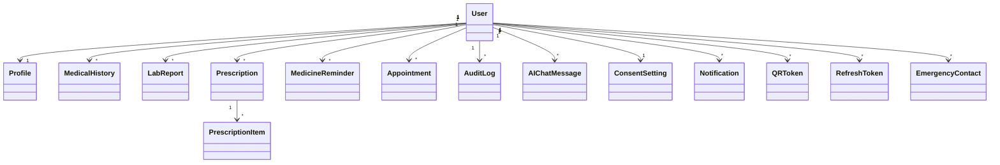

# Database Optimization and Schema Layout

The database is built on Neon PostgreSQL with connection pooling.

## Schema Architecture

We support 16 models linked by clear foreign key relationships with cascading deletes (`ondelete="CASCADE"`):

## Optimizations

### Connection Pooling
Production Neon DB connections use SQLAlchemy parameters:
- `pool_size`: `10`
- `max_overflow`: `20`
- `pool_recycle`: `1800` (Recycle connections every 30 minutes)
- `pool_pre_ping`: `True` (Prevents stale connections)

### Database Indexes
Indexes are configured for high-frequency queries:
- `email` & `phone` in `users`
- `qr_token` in `qr_tokens`
- `refresh_token` in `refresh_tokens`
- `user_id` in relational tables
- `created_at` in `reports` and `audit_logs`
